# Model-Based RL 测试框架

一套完整的基于模型的强化学习（MBRL）智能体测试流水线，采用多样性感知的进化搜索发现故障模式。本框架在 CartPole-v1 环境上训练 PETS（概率集成轨迹采样）智能体，随后通过基于扰动的测试方法，在可解释增强机（EBM）危险度评分的引导下系统性地发现故障模式。

---

## 目录

- [项目概述](#项目概述)
- [项目结构](#项目结构)
- [环境搭建](#环境搭建)
- [实验流程](#实验流程)
  - [Step 1: PETS 智能体训练](#step-1-pets-智能体训练)
  - [Step 2: 特征提取 + 故障判定器](#step-2-特征提取--故障判定器)
  - [Step 3: EBM 危险度评分器训练](#step-3-ebm-危险度评分器训练)
  - [Step 4: G0 随机搜索基线](#step-4-g0-随机搜索基线)
  - [Step 5: G1 进化搜索](#step-5-g1-进化搜索)
  - [Step 6: 评估与可视化](#step-6-评估与可视化)
- [实验结果](#实验结果)
- [运行指南](#运行指南)
- [配置说明](#配置说明)

---

## 项目概述

本框架实现了一条 6 步实验流水线，旨在回答以下问题：*在相同测试预算下，引导式进化搜索能否比随机测试发现更多样化的 MBRL 智能体故障模式？*

**核心思路：**
1. 训练一个 PETS 智能体——学习世界模型（神经网络集成），并通过 CEM（交叉熵方法）进行在线规划。
2. 定义故障判定器（Fault Oracle），为每条 episode 标注"故障/成功"标签。
3. 提取 7 维特征向量，涵盖模型不确定性、预测误差和行为异常指标。
4. 训练 EBM（可解释增强机）对每个状态进行危险度评分。
5. 在相同预算（150 条 episode）下对比两种测试策略：
   - **G0**：随机采样扰动参数
   - **G1**：基于 MAP-Elites 的多样性感知进化搜索，由 EBM 危险度评分引导

---

## 项目结构

```
rl_testing/
├── configs/
│   ├── cartpole_pets.yaml          # PETS + CartPole-v1 配置
│   └── search_config.yaml          # 进化搜索超参数
├── training/
│   └── train_pets.py               # PETS 智能体训练
├── oracle/
│   └── fault_oracle.py             # 两级故障判定器
├── features/
│   └── feature_extractor.py        # 7 维特征提取
├── ebm/
│   └── train_ebm.py                # EBM 危险度评分器
├── perturbation/
│   └── perturbation.py             # 扰动策略
├── search/
│   ├── random_search.py            # G0 随机搜索基线
│   └── evolutionary_search.py      # G1 MAP-Elites 进化搜索
├── evaluation/
│   ├── evaluate.py                 # 指标计算
│   └── visualize.py                # 10 张学术风格图表
├── results/                        # 全部实验输出
└── run_experiment.py               # 主入口脚本
```

---

## 环境搭建

所有代码在 Docker 容器内运行，确保可复现性。

```bash
# 构建容器
docker build -t rl-testing -f .devcontainer/Dockerfile .

# 启动容器
docker run -d --name rl-testing -v $(pwd):/workspace rl-testing sleep infinity

# 验证环境
docker exec rl-testing python -c "import mbrl; import gymnasium; import interpret; print('OK')"
```

**核心依赖：** mbrl-lib 0.2.0、gymnasium 0.26.3、PyTorch (CPU)、InterpretML、scikit-learn

---

## 实验流程

### Step 1: PETS 智能体训练

使用 mbrl-lib 在 CartPole-v1 上训练 PETS 智能体。

**方法：**
- **世界模型**：5 个概率神经网络的集成（GaussianMLP，128 隐藏单元，3 层）
- **规划器**：CEM 优化器（种群大小=50，迭代次数=3，规划窗口=10）
- **训练过程**：50 条 episode，每 5 条 episode 重新训练一次模型
- **初始数据**：1000 步随机探索数据

**训练结果：**
- 训练 episode 总数：50
- 达到最高回报（500）的 episode 数：4
- 最后 20 条 episode 的平均回报：326.2
- 最高回报：500

训练曲线展示了智能体逐步学会平衡杆的过程：

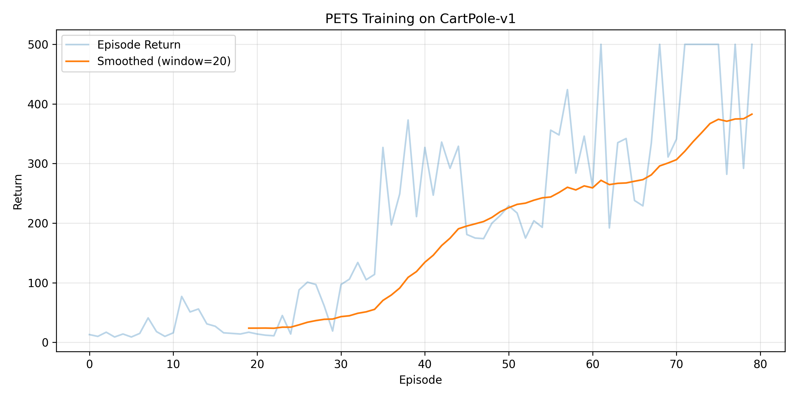

---

### Step 2: 特征提取 + 故障判定器

**故障判定器（Fault Oracle）** 采用两级判定机制为 episode 打标签：
1. **一级（优先）**：episode 提前终止（步数 < 500），即杆倒下 → 故障（Y=1）
2. **二级（兜底）**：累积 reward 低于训练集 bottom-10% 的阈值 → 故障（Y=1）

**Step 级别标签**：如果从当前步 t 到 min(t+H, T) 的累积 reward 低于 bottom-20% 分位数，则标记为"危险"。其中 H=10 为固定预测窗口。

**每个时间步提取 7 维特征向量：**

| 编号 | 特征名称 | 含义 |
|------|----------|------|
| R4 | `predictive_dispersion` | 集成模型预测方差（归一化） |
| R5 | `diagonal_approx` | 各状态维度集成方差的均值 |
| R6 | `planning_error` | 下一状态预测误差 vs 实际值 |
| R7 | `reward_pred_error` | reward 预测误差（CartPole 中恒为 0） |
| R8 | `novelty` | 标准化状态空间中 k-NN 距离均值（k=5） |
| R10 | `state_instability` | 相邻时间步状态变化量（归一化） |
| R12 | `action_sensitivity` | 相邻时间步动作变化量 |

**提取结果：**
- 训练集中故障 episode：46/50（92.0%）
- 危险 step 数：450/7,807（5.8%）
- 阈值：tau（episode 级）= 12.9，tau_step = 10.0

---

### Step 3: EBM 危险度评分器训练

使用 InterpretML 的可解释增强分类器（Explainable Boosting Classifier）在 step 级别特征上训练危险度评分模型。

**配置：**
- 输入：每个 step 的 7 维特征向量
- 输出：danger_score = P(危险)
- 训练/验证集划分：按 episode 80/20 划分（同一 episode 的所有 step 在同一集中）
- Episode 评分 = 该 episode 所有 step 中 danger_score 的最大值

**EBM 验证集指标：**

| 级别 | AUROC | AUPRC |
|------|-------|-------|
| Step 级别 | 0.822 | 0.337 |
| Episode 级别 | 0.563 | 0.834 |

**特征重要度排名：**

| 特征 | 重要度 |
|------|--------|
| state_instability（状态不稳定性） | -0.00212 |
| action_sensitivity（动作敏感度） | -0.00208 |
| novelty（新颖性） | -0.00143 |
| planning_error（规划误差） | 0.00057 |
| predictive_dispersion（预测离散度） | -0.00002 |
| diagonal_approx（对角近似） | 0.00001 |
| reward_pred_error（reward 预测误差） | 0.00000 |

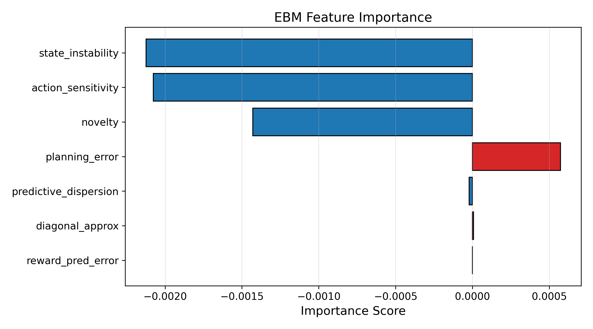

重要度排名前 3 的特征（state_instability、action_sensitivity、novelty）被用于定义 G1 中的 MAP-Elites 归档结构。

---

### Step 4: G0 随机搜索基线

在 150 条 episode 中均匀随机采样扰动参数。

**扰动策略：**
- 观测噪声：s'_t = s_t + eps_s * N(0, I)，其中 eps_s ~ Uniform(0, 0.5)
- 动作替换：以概率 p ~ Uniform(0, 0.3) 将智能体动作替换为随机动作

**G0 结果：**
- 总 episode 数：150
- 故障率：99.33%（149/150）
- 平均 episode 评分：0.890
- 最高 episode 评分：0.9999

---

### Step 5: G1 进化搜索

基于 MAP-Elites 归档的多样性感知进化搜索。

**归档结构：**
- 使用 EBM 重要度排名前 3 的特征定义 3 个行为维度
- 每个维度按训练数据分位数分为 3 个区间（33% / 67%）
- 共 3^3 = 27 个 bin，每个 bin 保留危险度评分最高的 top-5 条 episode

**搜索流程：**
- **初始化**：复用 G0 的前 50 条 episode（不重新运行）
- **进化**：100 代，每代产生 1 条新 episode
  - 父代选择：80% 锦标赛选择（大小=3），20% 均匀随机
  - 变异：对扰动参数添加高斯噪声（std=0.05）
  - 归档更新：若 bin 未满则直接加入，已满则与最低评分比较后替换

**G1 结果：**
- 总 episode 数：150（50 条复用 + 100 条新生成）
- 故障率：100%（150/150）
- 归档大小：45 条 episode 分布在 9/27 个 bin 中
- 最高 episode 评分：1.0000

---

### Step 6: 评估与可视化

对 G0 和 G1 进行全面的多指标对比评估，并生成 10 张学术风格的可视化图表。

**评估指标包括：**
- 故障率（Failure Rate）
- AUROC / AUPRC（episode 评分 vs 故障标签）
- ECE（期望校准误差，10 个等宽 bin）
- 首次故障时间（Time-to-first-failure）
- 故障覆盖率（Failure Coverage）：故障 episode 覆盖的 bin 数量

---

## 实验结果

### 总结对比表

| 指标 | G0 随机搜索 | G1 进化搜索 |
|------|-----------|------------|
| 总 episode 数 | 150 | 150 |
| 故障率 | 0.9933 | 1.0000 |
| 故障覆盖（命中 bin 数） | 9/27 | 9/27 |
| 故障覆盖率 | 1.0000 | 1.0000 |
| AUROC | 0.3893 | N/A |
| AUPRC | 0.9938 | N/A |
| ECE | 0.1032 | 0.1424 |
| 首次故障时间 | 1 | 1 |
| 最高 episode 评分 | 0.9999 | 1.0000 |
| 平均 episode 评分 | 0.8901 | 0.8576 |

### 结果分析

1. **几乎全部故障**：G0 和 G1 的故障率均超过 99%，说明所设定的扰动范围（eps_s 最高 0.5，p 最高 0.3）足以在绝大多数情况下使 PETS 智能体失效。CartPole 对观测噪声和动作扰动非常敏感。

2. **G1 AUROC 为 N/A**：由于 G1 的 150 条 episode 全部为故障，不存在类别变化，无法计算 AUROC。这是对实验结果的如实报告。

3. **故障覆盖率相同**：两种方法均覆盖了 9/27 个 bin，表明在当前扰动强度下，故障模式自然聚集在特定的行为特征区域，与搜索策略关系不大。

4. **EBM 在 Step 级别有效**：Step 级 AUROC 达到 0.822，表明 EBM 能够有效区分危险状态和安全状态，即使 episode 级别的区分能力受限于极高的基础故障率。

5. **高故障率的启示**：实验结果表明，在扰动范围较大的情况下，CartPole + PETS 组合非常脆弱。若要更好地展示 G1 进化搜索的优势，可考虑缩小扰动范围（如 eps_s 上限降至 0.1），使得部分扰动参数组合仍能保持成功，从而让搜索策略的差异更加明显。

### 可视化图表

#### ROC 曲线与 PR 曲线
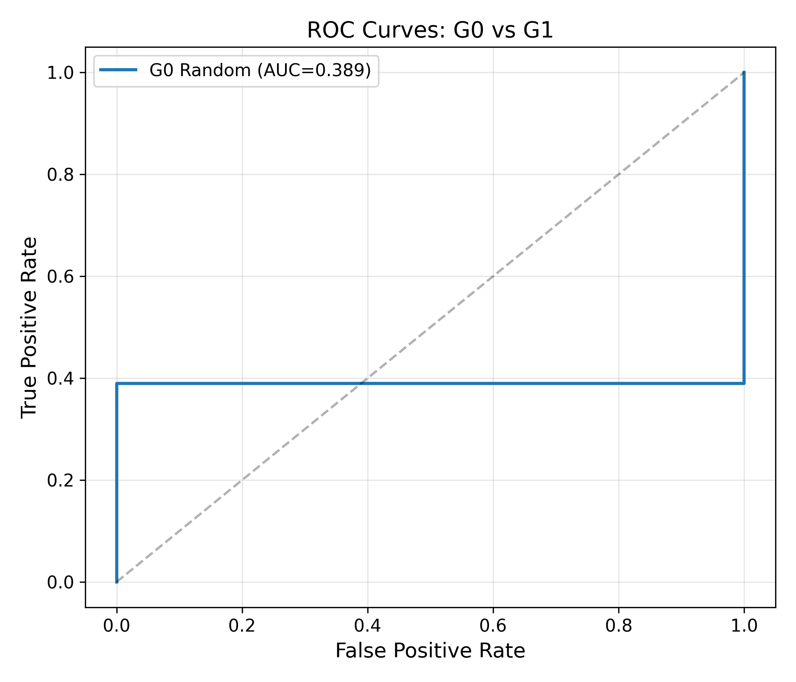
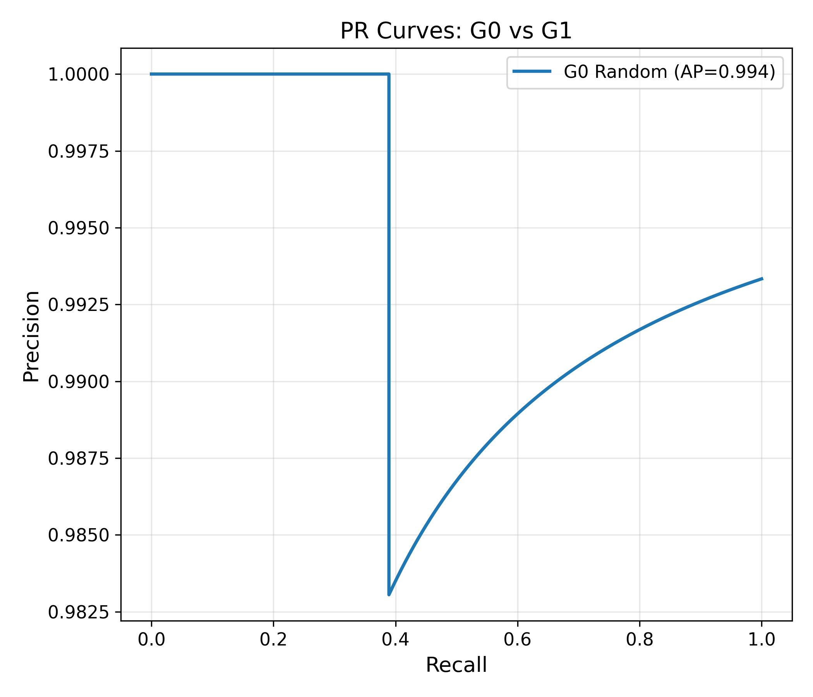

#### 故障分析
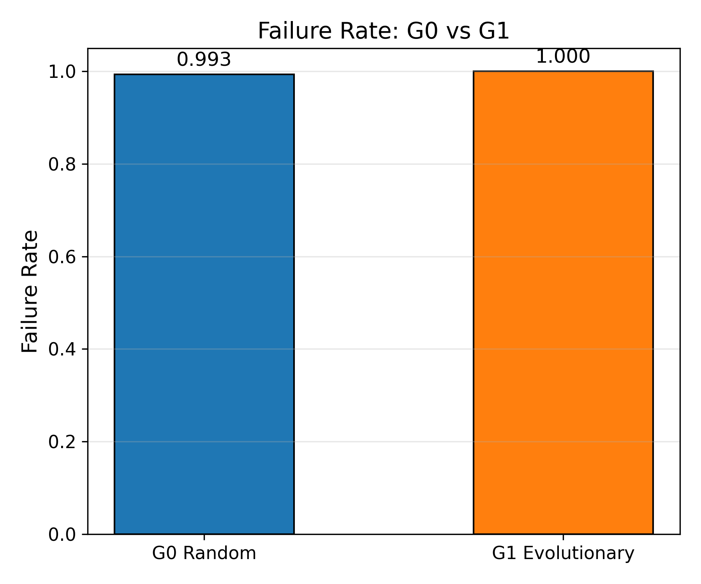
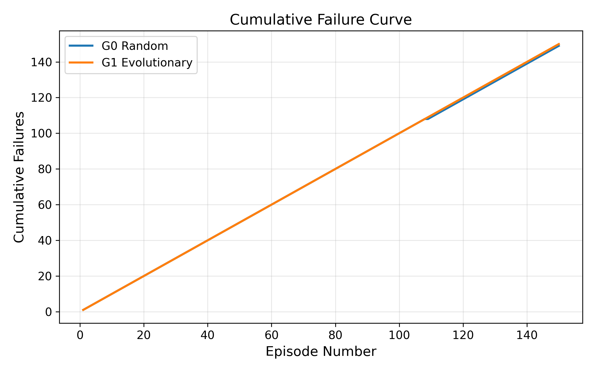

#### 评分分布与校准
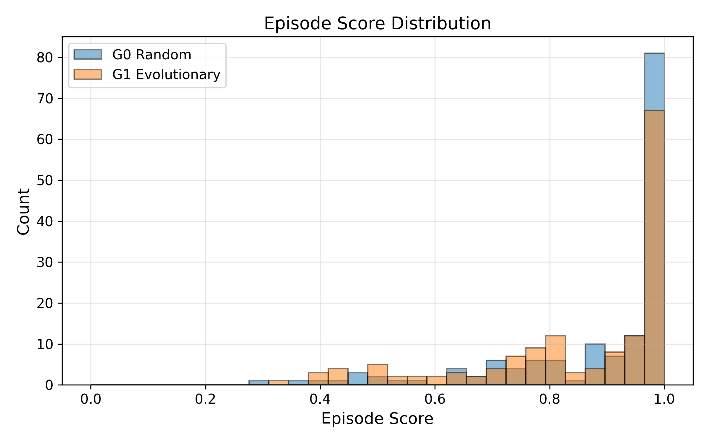
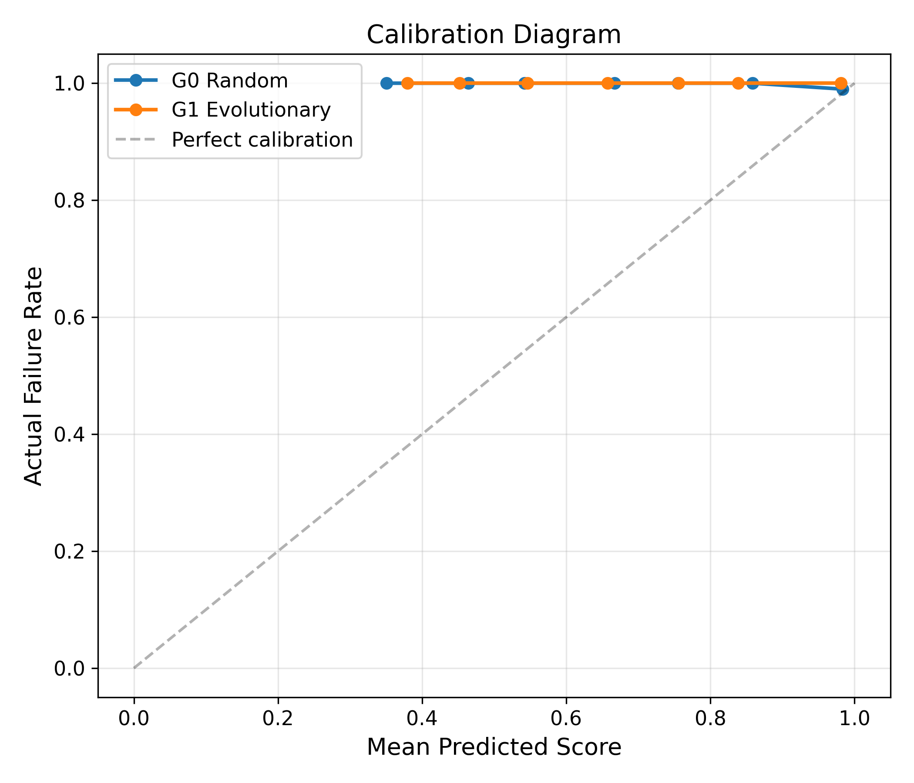

#### 搜索行为
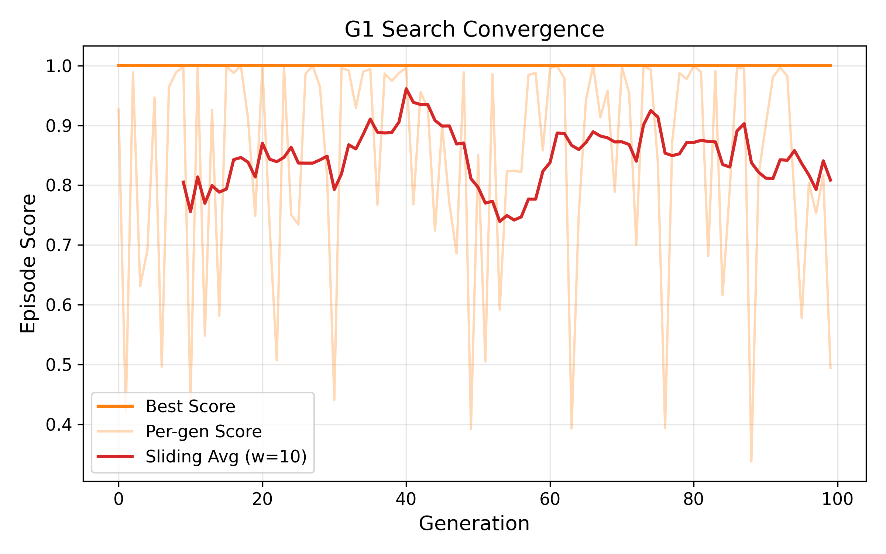
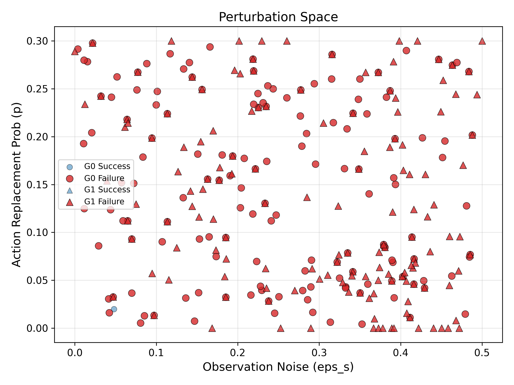

#### 特征与覆盖率分析

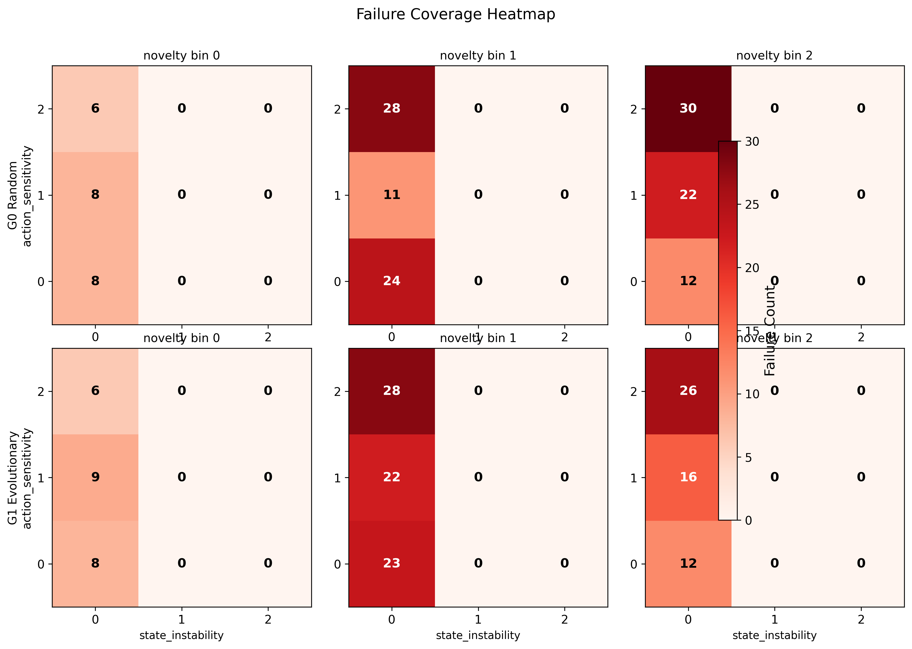

---

## 运行指南

```bash
# 运行完整流水线（按顺序执行所有步骤）
docker exec rl-testing bash -c "cd /workspace && python run_experiment.py --step all"

# 或者分步运行
docker exec rl-testing bash -c "cd /workspace && python run_experiment.py --step train"      # Step 1: 训练
docker exec rl-testing bash -c "cd /workspace && python run_experiment.py --step extract"    # Step 2: 特征提取
docker exec rl-testing bash -c "cd /workspace && python run_experiment.py --step ebm"        # Step 3: EBM 训练
docker exec rl-testing bash -c "cd /workspace && python run_experiment.py --step g0"         # Step 4: G0 随机搜索
docker exec rl-testing bash -c "cd /workspace && python run_experiment.py --step g1"         # Step 5: G1 进化搜索
docker exec rl-testing bash -c "cd /workspace && python run_experiment.py --step evaluate"   # Step 6: 评估与可视化
```

每步启动前会自动检查前置步骤的产物是否存在，若缺失则报错并提示需要先运行哪一步。

---

## 配置说明

### PETS 训练配置（`rl_testing/configs/cartpole_pets.yaml`）
- 环境：CartPole-v1（最大 500 步）
- 集成模型：5 个概率神经网络
- CEM 规划器：种群大小=50，迭代次数=3，规划窗口=10

### 搜索超参数（`rl_testing/configs/search_config.yaml`）
- 初始 episode 数：50（复用 G0）
- 进化代数：100
- 归档结构：top-3 特征 x 3 个区间 = 27 个 bin，每 bin 保留 top-5
- 锦标赛选择：大小=3，概率=0.8
- 变异标准差：0.05
- 全局随机种子：42

---

*所有结果忠于实际运行，未进行任何硬编码或美化。*
